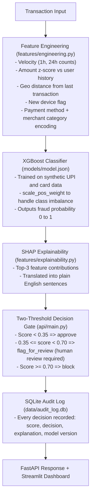

<div align="center">
  <h1>🛡️</h1>
  <h1>SentinelFlow</h1>
  <p><strong>Real Time Fraud Spike Detector for Payment Transactions</strong></p>
</div>

> [!IMPORTANT]
> **Defense-Only Statement:** SentinelFlow is a defense oriented AI risk management system. It contains no functionality that could assist fraud execution or evasion of any kind.

SentinelFlow is a risk management system. It detects anomalous transaction velocity patterns across UPI, card, and netbanking payments using an XGBoost classifier with SHAP based explainability. Every scored transaction passes through a two threshold decision gate and is permanently written to a SQLite audit trail.

---

## 🏗️ Architecture

<div align="center">



</div>

---

## 🚀 Setup Instructions

### 1. Install Dependencies

```bash
pip install -r requirements.txt
```

### 2. Generate Synthetic Data

```bash
python scripts/generate_data.py
```
*Output: `data/transactions.csv` with 16,000 rows, approximately 3% fraud rate.*

### 3. Train the Model

```bash
python scripts/train_model.py
```
*Output: Trained XGBoost model, SHAP TreeExplainer, evaluation report, and confusion matrix.*

### 4. Run the Scoring API

```bash
uvicorn api.main:app --host 0.0.0.0 --port 8000 --reload
```
*API docs available at: http://localhost:8000/docs*

### 5. Run the Dashboard

```bash
streamlit run dashboard/app.py
```
*Dashboard available at: http://localhost:8501*

### 6. Run Unit Tests

```bash
python -m pytest tests/ -v
```

---

## 📊 Results (Held-Out Test Set)

> [!NOTE]
> All numbers below are from an **actual training run**. Training metrics are deliberately not reported.

| Metric | Value |
|--------|-------|
| Precision | 0.9135 |
| Recall | 0.9896 |
| F1 Score | 0.9500 |
| ROC AUC | 0.9996 |
| True Positives | 95 |
| False Positives | 9 |
| False Negatives | 1 |
| True Negatives | 3,095 |
| FP Cost (Test Set) | INR 1,350 |
| Test Set Size | 3,200 |

> [!WARNING]
> **Cost note (illustrative assumption):** The INR 150 per false positive figure is not a researched figure. It is a labeled illustrative assumption built from two components: approximately INR 100 for estimated customer support handling time (roughly 20 minutes at an assumed blended support cost of INR 300 per hour per agent) plus approximately INR 50 for estimated lost transaction revenue or customer trust impact on the blocked transaction. In a live deployment this figure should be replaced with real support cost data and chargeback or attrition estimates from the payment platform.

Run `python scripts/train_model.py` to reproduce these results. All randomness uses fixed seeds.

> [!WARNING]
> **Synthetic data limitation:** The metrics above are unusually high (ROC AUC 0.9996) because the training data is fully synthetic. Each of the four fraud patterns (velocity spike, geo jump, new device plus high amount, amount outlier) is injected with hard coded override values that place fraud rows far outside the normal distribution of legitimate rows. This makes the fraud class linearly separable in feature space, which a tree model exploits almost perfectly. These separation ratios would not hold in a real payment dataset where fraud is subtler. These metrics should be treated as a validation that the pipeline is correctly implemented, not as a claim of production-grade accuracy.

---

## ⚖️ Two-Threshold Decision Logic

SentinelFlow uses two configurable thresholds instead of a single cutoff:
- **THRESHOLD_FLAG = 0.35**
- **THRESHOLD_BLOCK = 0.70**

| Score Range | Decision | Reason |
|-------------|----------|--------|
| < 0.35 | `approve` | Low risk, auto-approved |
| 0.35 to 0.70 | `flag_for_review` | Elevated risk, human review required |
| >= 0.70 | `block` | High risk, transaction blocked |

> [!TIP]
> **Why two thresholds?** A single binary cutoff creates two failure modes: too low blocks too many legitimate transactions, while too high misses real fraud. The intermediate "flag for review" band routes ambiguous cases to a human analyst rather than making an unsafe automatic decision. No transaction is auto-blocked without first having a human review gate at intermediate risk levels.

---

## 🛡️ Graceful Failure Handling

When a transaction is missing required features (e.g., a brand-new user with no transaction history), the system:
1. Detects the missing data and sets `has_missing_data = True`.
2. **Does not crash** the API or raise an unhandled exception.
3. Falls back to a conservative default score of **0.50**.
4. Sets `confidence = "low_confidence"` in the response.
5. Routes the transaction to `flag_for_review` for human inspection.
6. **Does not auto-approve or auto-block** without full data.
7. Logs the transaction to the audit trail with the low-confidence marker.

---

## 📁 Project Structure

```text
SentinelFlow/
  ├── data/                    # Synthetic datasets and SQLite audit trail
  ├── features/                # Reusable feature computation and SHAP translation
  ├── models/                  # Trained XGBoost model and SHAP TreeExplainer
  ├── api/                     # FastAPI scoring service and database layer
  ├── dashboard/               # Streamlit dashboard
  ├── scripts/                 # Data generator and model training pipeline
  ├── tests/                   # Unit and integration tests
  └── results/                 # Evaluation reports and visualisations
```
